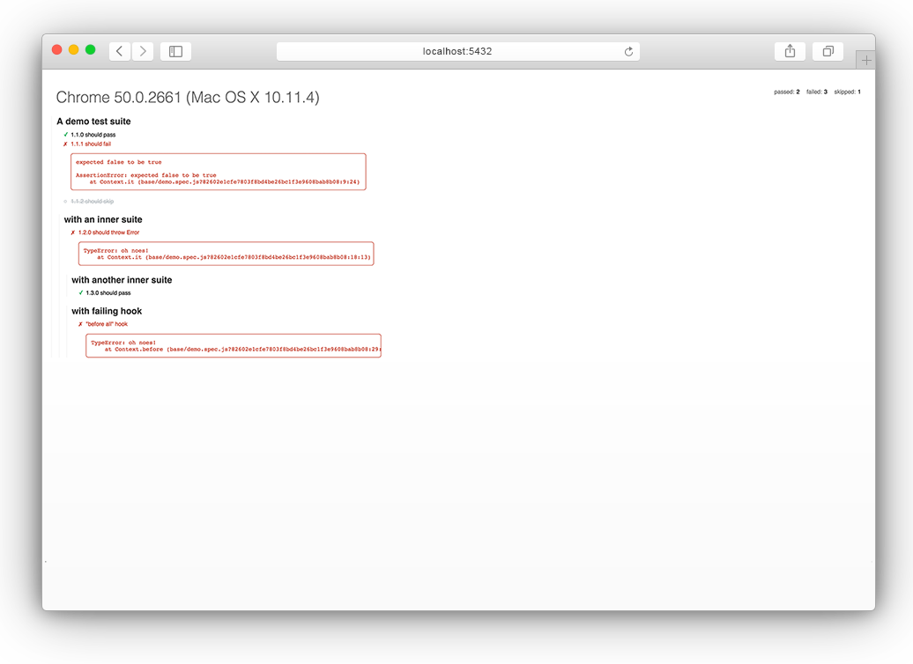

# karma-browser-reporter


[]()
[]()
[]()

<p align="center">
  
</p>

### Configuration

```javascript
// karma.conf.js
module.exports = function(config) {
  config.set({
    reporters: ['browser'],

    plugins: [
      'karma-browser-reporter'
    ],

    browserReporter: {
      port: 5432,
      ignoreSuccessful: false,
      ignoreFailed: false,
      ignoreSkipped: false
    }
  })
}
```
